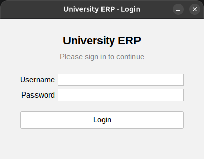
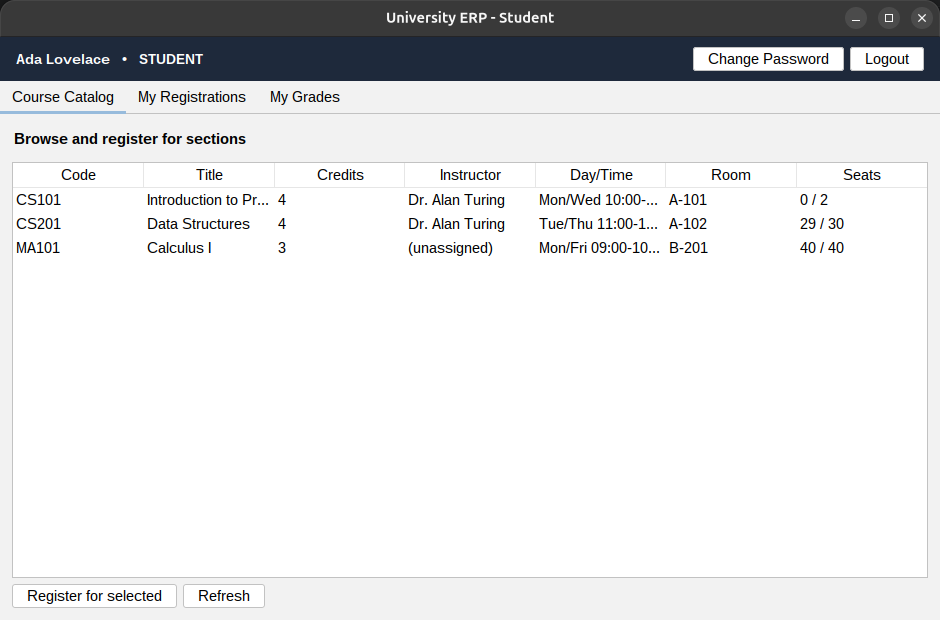
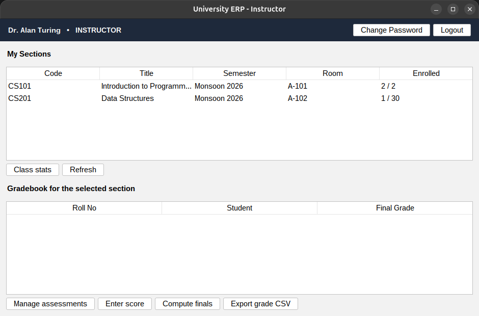
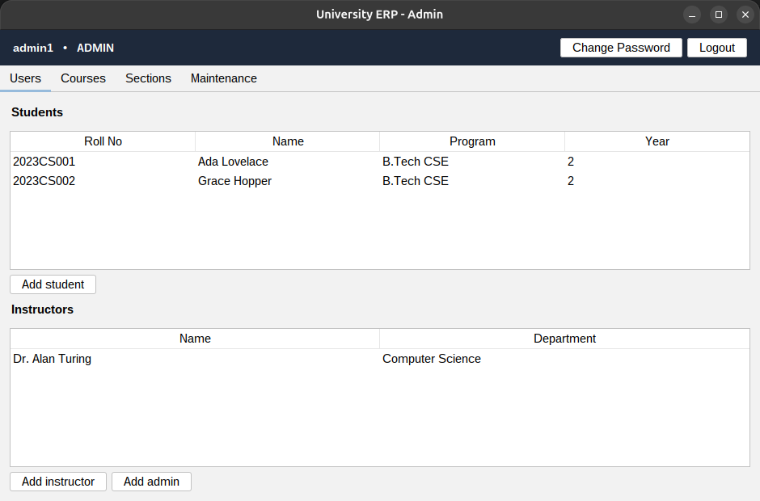

# University ERP (Java + Swing)

A desktop ERP for a university to manage **courses, sections, enrollments and grades**, with three
kinds of user — student, instructor and admin. Built with Java Swing on the front end and two
separate MySQL databases on the back end.

The one design idea the whole thing is built around: **auth data and academic data live in two
different databases**, the way a UNIX system keeps passwords in a separate "shadow" file. The login
database (`erp_auth`) only ever holds usernames, roles and bcrypt password *hashes*; everything else
(students, courses, grades, ...) lives in `erp_main`. They're linked by nothing more than a shared
`user_id`.

## Screenshots

| Login | Student | Instructor | Admin |
|-------|---------|-----------|-------|
|  |  |  |  |

## Architecture

Three layers, and the screens never talk to the database directly — they go through the service
layer, which is where every rule and permission check lives.

```
  Swing UI  ->  Service layer ("the brain")  ->  JDBC data layer  ->  MySQL (auth + erp)
                        |
                  Access control  (role checks + maintenance mode)
                  Auth            (bcrypt login, session)
```

| Package | What's in it |
|---------|--------------|
| `edu.univ.erp.domain`  | Plain data classes: `Student`, `Instructor`, `Course`, `Section`, `Enrollment`, `Assessment`, `Grade`, `User` |
| `edu.univ.erp.data`    | JDBC DAOs + the two connection pools (`Db`) |
| `edu.univ.erp.auth`    | Password hashing, login, `Session` — talks to the auth DB only |
| `edu.univ.erp.access`  | `AccessControl` — "is this user allowed?" and "is maintenance on?" |
| `edu.univ.erp.service` | The brain: register/drop, grading, admin actions. Enforces rules before any write |
| `edu.univ.erp.ui`      | Swing screens (login + the three dashboards) |
| `edu.univ.erp.util`    | Config loader + CSV/PDF exporters |

Whenever a button changes data, the service asks two questions first: **(1) is this user allowed to
do it, and (2) is maintenance mode off?** Only if both are yes does the change go through.

## What each role can do

- **Student** — browse the catalog, register for a section (if there are seats and it isn't a
  duplicate), drop before the deadline, see their timetable and grades, and download a transcript
  (CSV or PDF).
- **Instructor** — see only their own sections, define assessments, enter scores, compute final
  grades with a weighting rule (e.g. 20/30/50), view class stats, and export a grade CSV.
- **Admin** — add users (writes both the login and the profile), create courses and sections,
  assign instructors, delete empty sections, and toggle maintenance mode.

## How to run

**Requirements:** Java 17+ (built and tested on JDK 25), Maven, and MySQL 8.

**1. Create the databases and app user** (one time, as the MySQL admin):

```bash
sudo mysql < db/00_create_user.sql
```

**2. Load the schema and sample data:**

```bash
mysql --user=erp_app --password='ErpApp@2026!' < db/01_auth_schema.sql
mysql --user=erp_app --password='ErpApp@2026!' < db/02_erp_schema.sql
mysql --user=erp_app --password='ErpApp@2026!' < db/03_seed_auth.sql
mysql --user=erp_app --password='ErpApp@2026!' < db/04_seed_erp.sql
```

**3. Point the app at your database:** copy the config template and adjust if your credentials
differ (the default matches the setup script):

```bash
cp src/main/resources/app.properties.example src/main/resources/app.properties
```

**4. Build and run:**

```bash
mvn clean package
java -jar target/university-erp.jar
```

### Sample logins

| Username | Password  | Role       |
|----------|-----------|------------|
| `admin1` | `Admin@123` | Admin      |
| `inst1`  | `Inst@123`  | Instructor |
| `stu1`   | `Stu@123`   | Student    |
| `stu2`   | `Stu@123`   | Student    |

## Tech stack

Java Swing + [FlatLaf](https://www.formdev.com/flatlaf/) (look & feel) + MigLayout (layouts) ·
JDBC + MySQL + HikariCP (connection pooling) · jBCrypt (password hashing) · OpenCSV + OpenPDF
(exports) · JUnit 5 (tests) · Maven.

## Tests

```bash
mvn test
```

The unit tests use small in-memory stubs, so they run without a database. They cover password
hashing, the access/maintenance rules, the registration rules (seats, duplicates, deadline, role)
and the final-grade weighting. See [docs/TEST_PLAN.md](docs/TEST_PLAN.md) for the full acceptance
test list and [docs/TEST_SUMMARY.md](docs/TEST_SUMMARY.md) for results.
